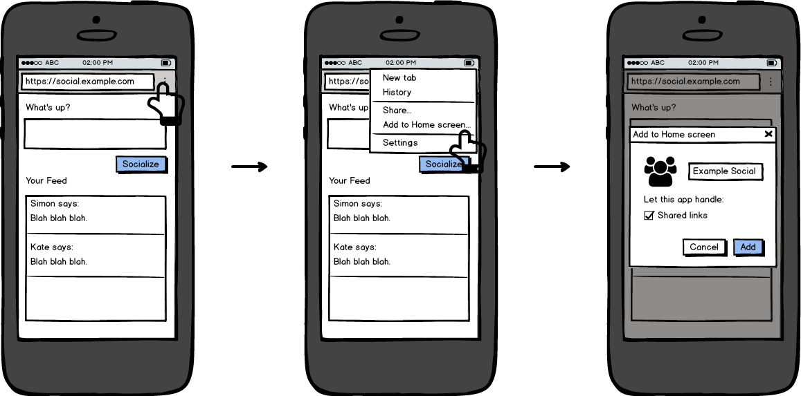
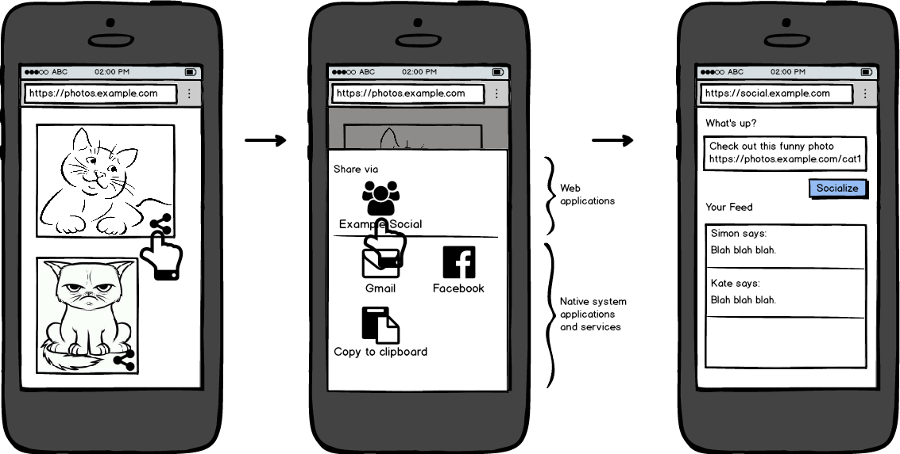

# Web Share Target API Explained

**Date**: 2016-06-01

**Web Share Target** is a proposed web API to enable a web site to receive
shared data from other sites or apps. Many modern operating systems have a
"share" concept, where the user gets to pick an app to receive the shared data.
The goal is to allow web apps to appear in the UI for picking an app to share
to.

In combination with the [Web Share API](../../share/docs/explainer.md) (being
proposed in parallel), this would allow cross-sharing between websites on any
platform (even those without a native sharing system).

This is a product of the [Ballista project](../../README.md), which aims to
explore website-to-website and website-to-native interoperability.

See also:
* [Interface document](interface.md), an informal spec.
* [Native integration survey](native.md), for platform-specific matters.

## User flow

### Registering a website as a handler on mobile

Here's how a user can register one of their favourite websites to receive share
actions from other websites and native apps. These mocks look a bit like
Android, but we're designing with general desktop and mobile operating systems
in mind.



[[Image credits](mocks/README.md)]

1. User visits a social networking website. The site has an `"actions"` section
   in its [web manifest](https://w3c.github.io/manifest/), declaratively
   specifying that it can receive share actions (see [code](#sample-code)).
2. User indicates to the browser that they wish to register the site. **For
   discussion:** We have not determined whether this should be a) something the
   site can trigger programmatically through a JavaScript API, b) something the
   user must trigger through the browser UI, or c) something the browser
   automatically prompts for in response to some stimulus (e.g., user visiting
   the site many times), or a combination of the above. At the moment, we are
   assuming there is no API and registration is at the discretion of the
   browser/user. In Chrome, we envision the "Add to Home screen" button on the
   browser drop-down menu will provide an adequate signal to register the
   handler.
3. The user confirms registration of the site for the purpose of "Shared links"
   (this string is tailored by the browser specifically for each verb the
   handler is requesting).

The site now shows up in share pickers. What that means depends on the
underlying system, as explored in the next section.

### Sharing from web to web on mobile

Here we see the interaction between the [Web Share
API](../../share/docs/explainer.md) and the Share Target API. You could also
share from a native app (depending on the system).



1. The user clicks "share" from a web page.
2. The intent picker is shown. "Example Social" appears in the list of
   applications, alongside native apps. Here, it is shown above a horizontal
   line, which is how it would appear in Android 6.0+ using the [Direct
   Share](http://developer.android.com/about/versions/marshmallow/android-6.0.html#direct-share)
   feature to dynamically insert handlers into the system intent picker. The
   user picks "Example Social".
3. The Example Social web page opens in a new browser tab. It is pre-populated
   (via an event being delivered to the page's service worker; see
   [code](#sample-code)) with the Subject and Message in the post text field.

This flow will be different depending on the capabilities of the operating
system. There are three broad approaches possible in descending order of
preference:

1. Handlers are inserted into the system share picker dialog, as shown above.
   This allows share events coming from native applications to be delivered to
   web applications via the same mechanism. This approach should be possible on
   Android 6.0 (M) and above.
2. The browser presents its own picker UI with all web handlers, as well as a
   "Share to system" button. Clicking "Share to system" triggers the system
   share picker dialog. This approach does not allow for native-to-web sharing,
   and also presents additional friction for web-to-native sharing.
3. The browser presents its own picker UI with all web handlers, and no way to
   share to native apps. This approach would be taken on platforms with no
   native sharing infrastructure (desktop operating systems).

**Potential pitfall**: With approach #1, we may need a way to filter out what
the user will perceive as duplicate entries: a native app and web app of the
same thing (e.g., Facebook), or the same web app registered with two browsers.
At least on Android, the web apps will be badged with the browser's icon.

For more technical details on integrating with native apps, see [Native
Integration Story](native.md).

## Sample code

Here's how to register a website to appear in the list of apps that can handle a
"share" intent on Android, or a "share" action from another website.

You need both a [web app manifest](https://w3c.github.io/manifest/) and a
[service
worker](http://slightlyoff.github.io/ServiceWorker/spec/service_worker/),
so that your site can be contacted even when the user does not have it open in
any tabs.

### manifest.webmanifest

```JSON
{
  "name": "Includinator",
  "short_name": "Includinator",
  "icons": [...],
  "supports_share": true
}
```

### serviceworker.js

```js
navigator.actions.addEventListener('share', event => {
  if (event.data.url === undefined)
    throw new Error('Did not contain URL.');

  includinate(event.data.url);
});
```

## Frequently Asked Questions

### Why is this needed?

This is one of the missing pieces of letting web apps behave like native apps.
We've recently gotten new web technologies to let websites be installed
alongside native apps, run outside of the browser window, theme the system title
bars, and receive push notifications. The one thing many web apps (chat clients,
social networking apps) need is a way to receive content from other web apps and
native apps.

### Why not use registerProtocolHandler?

This is discussed at length in the [Web Share
Explainer](../../share/docs/explainer.md), and depends on the outcome of that
decision. If we use a URI scheme for Share (instead of an API), then it would
make sense to use the existing
[registerProtocolHandler](https://developer.mozilla.org/en-US/docs/Web/API/Navigator/registerProtocolHandler)
API to let websites receive shares.

However, there are a number of downsides to this approach, discussed in the
other document. This is an open question.
