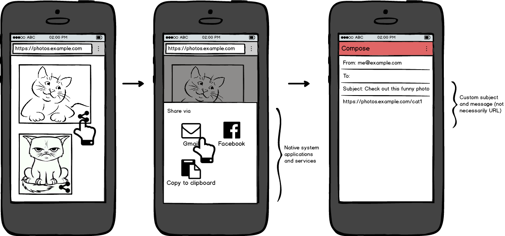

# Web Share Explained

**Date**: 2016-05-30

**Web Share** is a proposed web API to enable a site to share data (text, URLs,
images, etc) to an arbitrary destination of the user's choice. It could be a
system service, a native app or another website. The goal is to enable web
developers to build a generic "share" button that the user can click to trigger
a system share dialog.

This is a product of the [Ballista project](../../README.md), which aims to
explore website-to-website and website-to-native interoperability.

See also:
* [Interface document](interface.md), an informal spec.

## User flow

Here's how a user could share a link from a website to a native app of their
choice, on a site using Web Share. These mocks look a bit like Android, but
we're designing with general desktop and mobile operating systems in mind.



[[Image credits](../../docs/mocks/README.md)]

1. User is browsing a website containing a gallery of photos. User clicks a
   "share" link (denoted by the [generic share
   icon](https://design.google.com/icons/#ic_share)) for a specific photo. The
   website calls `navigator.actions.performAction('share')` (see
   [code](explainer.md#sharing-requester)) with a custom Subject and Message (in
   the common case, the message is a URL pointing at the selected photo).
2. A modal picker dialog is shown to the user, with a set of native applications
   and system actions (e.g., "Gmail", "Facebook", "Copy to clipboard"). On
   Android, this is the system intent picker, but the implementation may differ
   between browsers and operating systems. The user picks "Gmail".
3. The Gmail native app opens, and is pre-populated with the Subject and
   Message.

## Sample code

To let the user share the current page's URL with an app or website of their
choosing, just attach this JavaScript code to a "share" button.

```js
shareButton.addEventListener('click', () => {
  navigator.share({title: 'Example Page', url: window.location.href})
      .then(console.log('Share successful'));
});
```

You can also test in advance whether there are any installed apps or services
that support sharing (so you can not show the button if you know it won't work):

```js
if (!navigator.canShare())
  shareButton.hidden = true;
```

## Frequently Asked Questions

### Why is this needed?

We want to give users a way to quickly get content they find on the web
(primarily URLs, but also other text and image data) into their favourite apps
and services (social networking, text messaging, note taking).

The current options for sharing content from a web page are:

1. Share buttons to specific web services (e.g., Facebook and Twitter buttons).
2. Share buttons built into the browser UI. Many browsers, especially on mobile,
   have a "share" button that sends the current page URL to a native app of the
   user's choice.

Option #1 isn't ideal because: the targeted services are chosen by the *site*,
not the *user*, and because they support only limited sharing to native
applications (for native apps specifically designed to intercept URI schemes or
web URLs).

Option #2 has a number of issues:

* The site author is not able to present the share button in-line (requiring the
  user to go into a browser menu to activate).
* Only the current page URL can be shared, rather than specific pieces of
  content.
* The browser UI may not always be available, e.g., when a web app has been
  installed as a [standalone/fullscreen
  app](https://www.w3.org/TR/appmanifest/#display-modes).

So we'd like to build an API that solves all of these problems by giving website
authors a way to directly share arbitrary content to an app of the user's
choosing.

### How can a web app receive a share from another page?

We definitely want to let web apps receive shares, not just send them. To keep
the discussion focused, we've split that functionality out into a separate
proposal, the [Web Share Target API](../../share-target/docs/explainer.md).

### How is this different from other web intents / sharing systems?

There have been several past attempts at doing this, notably [Web
Intents](http://webintents.org) and Mozilla's [Web
Activities](https://developer.mozilla.org/en-US/docs/Web/API/Web_Activities),
both of which are no longer being developed.

We'd ultimately like to tackle the problems that those projects were trying to
solve (building a generic intents system for the web), but for now, we are just
focusing on the Share use case, and we think this focus will help avoid the
scope creep and over-generalized UI of those past attempts.

We also intend to interoperate with native apps right away, which solves the
bootstrapping problem of needing to wait for web developers to write share
targets before the Share API can be useful.

### Why can't sites just use Android intent: URLs?

On Android, web pages can have special links to [intent://
URLs](https://developer.chrome.com/multidevice/android/intents), which are
currently supported on Chrome and Firefox. Clicking such a URL fires an Android
intent. The intent can be targeted at a specific app (by its Android package
name) or be untargeted (showing the app picker UI).

Sites can use this right now to [implement a generic share
button](https://paul.kinlan.me/sharing-natively-on-android-from-the-web/), but
there are a number of issues:

* It only works on Android.
* For security reasons, the intent is forced to have the
  [`BROWSABLE`](https://developer.android.com/reference/android/content/Intent.html#CATEGORY_BROWSABLE)
  category (which means it can only be received by Android apps that are happy
  to receive intents from the web; in practice, there are very few such apps).
* It only lets users choose native apps (not websites).

We think the web deserves a standardized API for this.

### Why not standardize Android intent: URLs?

Android intent: URLs are too powerful and specific to Android. They can target a
specific Android app (by its Java package name), have any action (not just
`SEND`), and use Android-specific terminology and syntax.

Standardizing this would require at least some changes to the syntax and
additional restrictions, as well as removal of the `BROWSABLE` restriction, so
we'd have to change the name. Given that we'll be making incompatible changes,
we may as well design a new API from scratch.

### Why not make a share URI scheme (like mailto:) instead of a JavaScript API?

This is an interesting proposal that has come up several times. We could
introduce a new URL scheme `share:` that performs a share action when clicked. A
HTML page could provide a share button like this:

```html
<a href="share:?title=Example%20Page&amp;url=https://example.com/page">Share this</a>
```

This is largely sound and has a couple of advantages over the DOM API:

* The link can be placed declaratively on the page, with no need for a
  JavaScript click event handler.
* A page could register to receive shares via the
  [registerProtocolHandler](https://developer.mozilla.org/en-US/docs/Web/API/Navigator/registerProtocolHandler)
  API without the need for a new [Share Target API](../../share-target/docs/explainer.md).

but this has a few practical concerns:

* Sharing the page's own URL (a very common case) would require some scripting
  to inject the page URL into the `href` attribute.
* There is no API to determine whether share is supported on the user's system.
* There is no promise or callback to signal the success or failure of the share
  action.

as well as the theoretical issue (shared with `mailto:` and `intent:`) that URIs
are supposed to identify *resources*, not specify *actions* (See [RFC 3986 §
1.2.2 Separating Identification from
Interaction](https://tools.ietf.org/html/rfc3986#section-1.2.2)). This would be
a bit of an abuse of the URI concept (albeit with precedent). See detailed
discussion [here](https://github.com/chromium/ballista/issues/21).

Whether to do this as an alternative to a DOM API should be part of the
discussion around this proposal.
